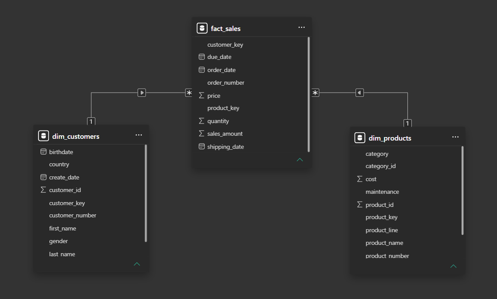
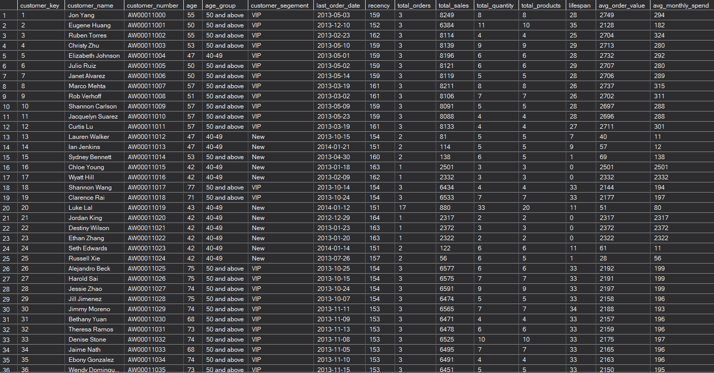
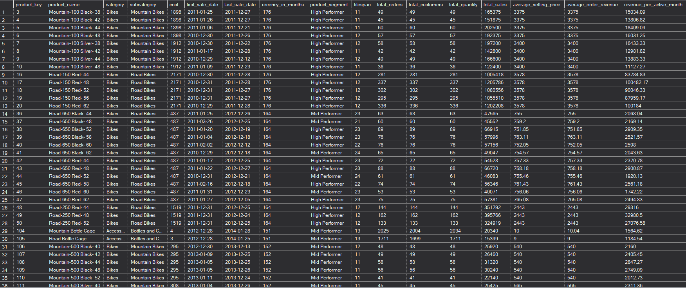

# Retail Sales Strategy Analysis: Uncovering Revenue Risks and Customer Retention Opportunities

## Project Background

This project analyzes a retail business selling Bikes, Accessories, and Clothing across six developed markets including the United States and Australia. Despite operating across multiple categories and geographies, the business faces two critical strategic risks:  extreme revenue concentration in a single product category and weak customer retention. This analysis was conducted to help the business decide whether to diversify revenue across categories and how to improve customer retention before these risks impact long term growth.

---

## Business decisions

1. Category Revenue Concentration
The leadership team needs to decide whether to diversify investment across all product categories or continue concentrating resources on the dominant category — because without understanding which categories drive revenue and which are underperforming, the business cannot assess its exposure to concentration risk.

2. Product Performance
The sales team needs to decide whether to double down on top performing products and address or discontinue underperforming ones — because without knowing which products are driving and draining revenue, marketing and inventory resources will be misallocated.

3. Customer Segmentation
The marketing team needs to decide whether to treat each customer segment differently or apply the same strategy to all customers — because without understanding how customers are distributed across value segments, the business will default to generic marketing and fail to retain its most valuable customers.

4. Average Order Value and Retention
The marketing team needs to decide whether to invest in a customer retention program — because without understanding how much each customer is worth per order, the business cannot calculate whether retaining existing customers is more cost effective than continuously acquiring new ones.

---

## Business Insights

### 1. Bikes dominate company revenue

Bikes account for 96.46% of total revenue, dwarfing Accessories at 2.39% and Clothing at 1.16%. This likely reflects either a catalog heavily weighted toward Bikes or significantly stronger consumer demand for cycling products in the company's target markets. While Bikes should remain the core focus, this extreme concentration creates existential risk: a single shift in consumer preference, supply chain disruption, or competitive pressure on Bikes could collapse the entire revenue base, making category diversification an urgent strategic priority.

---

### 2. Mountain-200 is the best-performing product line

All five top revenue-generating products belong to the Mountain-200 family, collectively generating over $6.6M: suggesting that customer demand is concentrated not just in the Bikes category but within a single product line inside that category. This likely reflects strong brand loyalty or superior product-market fit for the Mountain-200 specifically. While this is a significant strength to leverage through targeted marketing and inventory prioritization, it also deepens the concentration risk: if Mountain-200 faces a supply issue or loses competitive edge, the business loses its single biggest revenue driver overnight.

---

### 3. The United States is the largest market

The United States accounts for 7,482 customers — 40% of the total base: more than double Australia's 3,591, revealing heavy geographic concentration in a single market. This likely reflects where the company's early marketing efforts were focused rather than an inherent limitation of other markets. While the US should remain a priority, over-dependence on one geography creates vulnerability to local economic downturns, regulatory changes, or tariffs — making measured investment in underpenetrated markets like Germany and Canada a logical risk mitigation strategy.

---

### 4. Customer retention presents a major opportunity

79% of customers are classified as New with less than 12 months of purchase history, while only 9% have reached VIP status, suggesting the business is highly effective at acquiring customers but struggles to retain them. This pattern likely reflects the nature of high-value infrequent purchases like Bikes, where natural repurchase cycles are long. However, VIP customers represent disproportionate revenue potential and losing them to competitors is costly — making a targeted loyalty program for existing customers a higher ROI investment than continued heavy spending on new customer acquisition.

---

### 5. Customers purchase infrequently but spend significantly

With fewer than 1.5 orders per customer on average but an order value exceeding $1,000, the business operates on a high-value low-frequency model. This likely reflects the nature of the product: Bikes are considered purchases, not impulse buys. While this model is sustainable, it means every lost customer represents over $1,000 in immediate lost revenue and potentially thousands more in lifetime value, making even modest improvements in retention disproportionately impactful on total revenue.

---

### 7. Average selling price has steadily declined

Average selling price fell from $3,101 in 2010 to $1,668 in 2014, a 46% decline over four years. This likely reflects a gradual shift in product mix toward lower-priced Bike models, increased promotional discounting to drive volume, or growing competition forcing price reductions. While higher volume at lower prices can sustain revenue short term, sustained price erosion without a corresponding increase in units sold will compress margins, making it critical to understand whether this trend reflects deliberate strategy or unmanaged competitive pressure.

---

## Recommendations

| Priority | Action | Evidence | Owner | Expected Impact | Metric to Track |
|----------|--------|----------|-------|-----------------|-----------------|
| P0 | Launch category diversification strategy | Bikes = 96.46% of revenue | Sales and Marketing Team | Reduce Bikes share below 80% in 12 months | Revenue share by category |
| P1 | Launch customer loyalty program | 79% customers are New, AOV exceeds $1,000 | Marketing Team | Increase VIP share from 9% to 15% | VIP percentage, repeat purchase rate |
| P2 | Double down on Mountain-200 and develop next hero product | All top 5 products are Mountain-200 variants generating $6.6M | Product and Sales Team | Grow second product line revenue by 20% | Mountain-200 share, second product line revenue |
| P3 | Geographic diversification into Germany and Canada | US = 40% of customers, double any other market | Sales and Marketing Team | Grow Germany and Canada base by 25% | Customer distribution by country |

## Appendix

### Project Structure

#### Phase 1 — Exploratory Data Analysis (EDA)
Explores the database structure, validates data quality, profiles customer and product dimensions, and calculates headline business metrics to establish a foundational understanding of the data before deeper analysis.

#### Phase 2 — Advanced Analysis
Builds on the EDA to answer specific business questions through time series analysis, cumulative trends, year-over-year product performance, category contribution, customer and product segmentation, and two comprehensive reporting views — Customer Report and Product Report.

---

### Technical Skills Demonstrated

- Window Functions (`SUM`, `AVG`, `LAG`, `OVER`, `PARTITION BY`)
- Common Table Expressions (CTEs)
- Complex JOIN operations
- Aggregate Functions (`GROUP BY`, `HAVING`)
- CASE expressions for business logic and segmentation
- Subqueries and derived tables
- Views (`CREATE OR ALTER VIEW`)
- Date Functions (`DATETRUNC`, `DATEDIFF`, `YEAR`, `MONTH`)
- NULL handling (`ISNULL`, `NULLIF`)
- Data type casting
- `UNION ALL` for consolidated reporting
- Data Quality Checks: NULL detection, duplicate identification
---

### Tools & Technologies

- Microsoft SQL Server: database engine for all query execution
- SQL Server Management Studio (SSMS): primary development environment
- Git: version control
- GitHub: project hosting and portfolio presentation

---

### Database Schema

The project follows a **Star Schema** consisting of one fact table and two dimension tables.

- **gold.fact_sales** — Transaction-level sales records
- **gold.dim_customers** — Customer demographics and geographic information
- **gold.dim_products** — Product, category, subcategory, and cost information

---

### Reporting Views

#### Customer Report

The Customer Report provides a consolidated view of customer purchasing behavior, revenue contribution, order frequency, customer segmentation, and key customer metrics.

#### Product Report

The Product Report provides a consolidated view of product performance, revenue contribution, pricing metrics, product segmentation, and sales trends.

